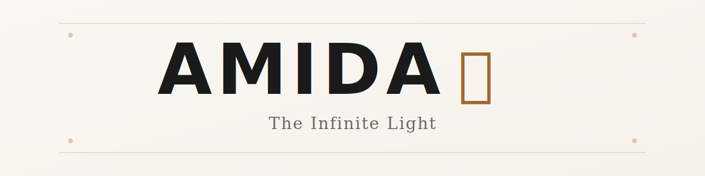

<div align="center">
  <br />
  
  <br />

  <h1>AMIDA-MI (谧)</h1>
  <h3>Infinite Light Meets Tranquil Depth</h3>

  <blockquote>
    <em>
      "Where the <strong>Infinite Light</strong> of innovation meets the <strong>Tranquil Depth</strong> of logic.<br>
      A play on identity: Derived from <strong>H(amida)h</strong> — pronounced <strong>'Amida is Me'</strong>."
    </em>
  </blockquote>
  
  <p>
    <strong>Stunning yet Tranquil.</strong> <br>
    An immersive web experience at the intersection of <strong>AI Engineering</strong>, <strong>Data Science</strong>, and <strong>Creative Technology</strong>.
  </p>

  <p>
    <a href="https://amida-mi.vercel.app"><strong>View Live Demo</strong></a> • 
    <a href="#-tech-stack"><strong>Tech Stack</strong></a> • 
    <a href="#-key-features"><strong>Features</strong></a> •
    <a href="#-portfolio-highlights"><strong>Portfolio Highlights</strong></a>
  </p>
</div>

<hr />

## 📖 The Philosophy: AMIDA-MI (谧)

**AMIDA-MI** is more than a name—it's a declaration of identity and design philosophy.

### The Dualism
- **"Amida"** (*Infinite Light*) represents the chaos of innovation, endless possibilities, and the boundless nature of technology. It embodies the **Day Mode** aesthetic—clarity, focus, and structured brilliance.
- **"Mi"** (*谧* - Tranquility) represents the stability of deep logic, the calmness of understanding, and the organized nature of algorithms. It embodies the **Night Mode** aesthetic—mystery, depth, and bioluminescent wonder.

### The Origin
The name is derived from the core of my identity: **H(amida)h** (Hafsah Hamidah). It's a linguistic play that weaves my name with philosophical meaning.

### The Declaration
Phonetically, "Mi" resonates with "Me"—so **"Amida is Me."** This work is a direct reflection of my values, ambitions, and technical journey.

---


## 📖 About The Project

**AMIDA-MI** is a concept portfolio designed to showcase the intersection of rigorous Computer Science fundamentals and artistic digital expression.

Built for **Hafsah Hamidah**, a Software Engineer specializing in AI & Data, this platform moves beyond static resume templates. It utilizes **React Three Fiber** to create a living, breathing 3D environment that shifts between two distinct states:

* **Day Mode (The Tranquil):** A porcelain-white, foggy Zen garden representing clarity and focus.
* **Night Mode (The Stunning):** A bioluminescent, data-void ocean representing deep innovation and mystery.

---

## 🏆 Experience Overview

**Professional Experience**

- **Full-Stack Developer, Xtrahera Innovations** (Remote, Mar 2025 – Present)
  - Delivered EdTech and E-Commerce solutions (AILearn, Maya Zaskia)
  - Managed full software lifecycle: database architecture, API development, deployment
  - Integrated AI chatbots and data scraping pipelines

- **Frontend Developer (Consultation Project), PT Rekayasa Industri (via Xtrahera)** (Hybrid, Mar 2025 – May 2025)
  - Developed "CoComm" approval dashboard for BUMN client
  - Translated Figma prototypes to responsive Next.js/Tailwind interfaces
  - Agile team collaboration, weekly sprints

- **IT Staff & Web Developer (Community Service/P2M), Kemakom UPI** (Indragiri Village, Jun 2025 – Aug 2025)
  - Digitized village administration, built Resident Data Security System
  - Designed tourism profile website, managed deployment and user training

- **Practicum Assistant - Database Management System, UPI** (On-site, Feb 2024 – Jun 2024)
  - Led lab sessions for 70+ undergraduates, taught advanced SQL and database design
  - Supervised final projects, evaluated code efficiency and query optimization

**Leadership & Organizational Experience**

- **Secretary, Competitive Programming Club (CPC) UPI** (Jan 2025 – Dec 2025)
  - Managed member databases, coordinated contests and training
  - Designed visual assets, managed internal communications

- **Head of Opening & Closing Subdivision, Dinamik 20 (Dies Natalis KEMAKOM UPI)** (Jun 2025 – Dec 2025)
  - Directed ceremonies, led team for stage flow and talent coordination
  - Developed artistic direction for event theme

- **Graphic Design Staff, Dinamik 19 (Dies Natalis KEMAKOM UPI)** (Jul 2024 – Dec 2024)
  - Designed branding assets, social media feeds, and print materials

- **General Treasurer, A-Storia Inauguration 2023** (Oct 2023 – Nov 2023)
  - Managed event budget and financial reporting

---

## 📖 About Me

**Academic Excellence Meets Practical Innovation**

Third-year Computer Science student at Universitas Pendidikan Indonesia (GPA 3.84/4.00). I specialize in building scalable web applications, engineering intelligent data pipelines, and developing real-time AI solutions. My journey spans Full-Stack Development, creative technology, and research in Ethnopedagogy and Smart Systems, with a current focus on Deep Learning, Computer Vision, NLP, and Data Engineering.

This portfolio is built with Next.js, TailwindCSS, Zustand, GSAP (GreenSock Animation Platform), and React Three Fiber for immersive 3D experiences. The site leverages advanced animation, custom shaders, and interactive UI/UX to showcase both technical and creative skills. Every section is designed to be responsive, performant, and visually engaging, reflecting my passion for merging logic and creativity in software engineering.

## 🚀 Key Features

* **Dual-Realm Atmosphere:** A global state management system (Zustand) that completely transforms lighting, fog density, materials, and typography contrast between Day and Night modes.
* **Interactive 3D Scene:** A procedural "Liquid Mirror" floor built with custom shaders (`MeshDistortMaterial`) and floating instanced geometry that reacts to mouse movement.
* **Immersive Navigation:** Instead of standard scrolling, the UI uses a "Floating Glass Pill" dock and fullscreen modal overlays for project details, maintaining a single-page application (SPA) feel.
* **Performance Optimized:** Utilizing `InstancedMesh` for particles and optimized heavy assets to ensure 60FPS rendering on modern browsers.
* **Detailed Project Showcases:** dedicated modals for technical deep-dives (Architecture, Problems, Solutions) covering AI, IoT, and Data Engineering projects.

## 🛠 Tech Stack

Built with a modern, polyglot ecosystem focusing on **performance, scalability, and creative expression**.

| Category | Technologies |
| :--- | :--- |
| **Core Framework** |    |
| **Styling & UI** |    |
| **3D & Graphics** | **React Three Fiber (R3F)**, **Drei**, **Three.js**, **Custom Shaders** |
| **Backend & Data** |     |
| **Databases** |    |
| **AI/ML & Data** | **YOLOv8**, **TensorFlow Lite**, **Apache Airflow**, **Pandas**, **NLP**, **Computer Vision** |
| **Mobile & IoT** |   **MQTT**, **ESP32 (C++)** |
| **DevOps & Tools** |   **CI/CD**, **Figma** |
| **State Management** | **Zustand**, **Redux** |
| **Icons & UI Libs** | **Lucide React**, **Shadcn/ui** |

## 📂 Portfolio Highlights

### **🌟 Featured Projects (The "Big 4")**

#### **1. SIGMA-UMKM — Polyglot Persistence Monitoring Platform**
- **Role:** System Architect & Data Engineer  
- **Date:** Dec 2025 – Jan 2026
- **Tech Stack:** `Apache Cassandra` `MongoDB` `Docker` `Next.js 16` `TypeScript`
- **Description:** A centralized monitoring ecosystem supporting SDGs 8, tracking the legality of Indonesian MSMEs with hybrid database architecture.
  - **Polyglot Persistence:** MongoDB for dynamic geospatial profiles + Cassandra for high-velocity financial audit trails.
  - **Performance:** Optimized partition keys for sub-millisecond time-series retrieval.
  - **Security:** RBAC implementation and Zod validation for API endpoints.

#### **2. Smart Batik Lens — Edge AI Object Detection**
- **Role:** AI/ML Engineer  
- **Date:** Dec 2025 – Jan 2026
- **Tech Stack:** `Python` `YOLOv8` `TensorFlow Lite` `Flutter` `Computer Vision`
- **Description:** Real-time mobile app detecting Indonesian Batik motifs on complex surfaces (folded/distorted fabrics).
  - **Edge AI:** Quantized YOLOv8 to INT8 TFLite (~6MB, 70% reduction), achieving 15+ FPS on mobile.
  - **Data Strategy:** 900+ curated images with aggressive geometric augmentation (perspective warp).

#### **3. PantaniZz — IoT Hydroponic Automation**
- **Role:** Backend & IoT Engineer  
- **Date:** Feb 2025 – Jun 2025
- **Tech Stack:** `Golang` `MQTT` `C++ (ESP32)` `PostgreSQL` `Flutter`
- **Description:** End-to-end IoT ecosystem for automated hydroponic farming.
  - **Concurrency:** Golang backend handling concurrent sensor streams (pH, TDS, Temp) using Goroutines.
  - **Protocol:** MQTT for low-latency hardware-to-app communication.

#### **4. PahamSaham — Automated ETL Pipeline**
- **Role:** Data Engineer  
- **Date:** Feb 2025 – Jun 2025
- **Tech Stack:** `Apache Airflow` `Docker` `Python (Pandas)` `MongoDB` `FastAPI`
- **Description:** Automated ETL pipeline ingesting Indonesian stock market data (IDX) for financial analysis.
  - **Orchestration:** Complex daily workflows using Airflow + Docker.
  - **Data Processing:** Python scrapers for extraction, cleaning, and transformation into MongoDB.

---

### **💼 Professional & Commercial Projects**

**AILearn Pancasila** (EdTech Platform)  
- Full-Stack Engineer @ Xtrahera Innovations (Aug 2025)  
- Laravel, AI Chatbot Integration, Real-time Forums | [Live Website](#)

**Digital Approval System - CoComm** (Enterprise Software)  
- Frontend Developer @ PT Rekayasa Industri BUMN (Mar–May 2025)  
- Laravel, Tailwind CSS, Figma Prototypes, Agile Collaboration

**Mayazaskia** (E-Commerce Platform)  
- Full-Stack Developer @ Xtrahera Innovations (Jun 2025)  
- Laravel, E-Commerce, Dynamic Catalogs, Payment Integration

**Sistem Informasi Kependudukan** (Digital Transformation)  
- Full-Stack Developer @ P2M Kemakom UPI (Jul 2025)  
- PHP, Web Development, Information Systems, Village Administration | [GitHub](https://github.com/rayplv/WebKependudukanP2M)

---

### **🎓 Experimental & Academic Projects**

**EcoSCha** — *National Grant Awardee (PKM-RSH 2025)*  
Gamified environmental platform blending Sundanese ethnopedagogy with modern web gamification.

**XKW** — Social Media Platform  
Scalable Twitter-like clone focusing on NoSQL schema design for high-volume interactions.

**DOXXER** — Graph-Based Web Crawler  
Algorithm engineer implementing BFS/DFS to map organizational websites and visualize link routes.

**MASAKIO** — Culinary Recipe App  
Flutter mobile + Node.js/Express backend with clean REST API architecture.

**OS File System Simulator** — Operating Systems Concept Visualization  
Electron.js GUI simulating disk block allocation and fragmentation in real-time.

**BinBuddy** — Gamified Waste Management (Arkavidia 2025)  
UI/UX design focused on community-driven waste reduction missions.

**Forgotten Memory** — Indie Game (COMPFEST 16)  
2D adventure puzzle game with original character art and promotional trailer.

**Campink** — Equipment Rental Mobile App  
Flutter mobile application with product catalog and cart management.

**Sports Facility Reservation** — Booking System  
PHP + SQL with strict database normalization for facility schedule integrity.

---

### **🏆 Experience & Certifications**

**Software Engineer (Backend & AI)** | Xtrahera Innovations (Remote, Mar 2025 – Present)
- Commercial solutions for EdTech & E-Commerce
- Backend optimization, AI integration, data scraping

**Practicum Assistant (Database Management)** | UPI (Feb 2024 – Jun 2024)
- Mentored 70+ students in Schema Design, Normalization, Advanced SQL, Indexing

**IT Staff (System Implementer)** | P2M Kemakom UPI (Jun–Aug 2025)
- Digital transformation for village administration with RBAC security

**Secretary** | Competitive Programming Club UPI (Apr 2025 – Present)
- Club operations, technical training, community management

---

**Awards & Recognition:**
- 🏆 **National Grant Awardee (PKM-RSH 2025)** — EcoSCha Project
- 🏅 **Finalist — Indie Game Ignite (COMPFEST 16)** — Forgotten Memory
- 📜 **Alibaba Cloud Certified Developer**

## ⚡ Getting Started

To run this project locally, follow these steps:

1.  **Clone the repository**
    ```bash
    git clone [https://github.com/hafsahha/amida-portfolio.git](https://github.com/hafsahha/amida-portfolio.git)
    ```

2.  **Install dependencies**
    ```bash
    cd amida-portfolio
    npm install
    # or
    yarn install
    ```

3.  **Run the development server**
    ```bash
    npm run dev
    ```

4.  Open [http://localhost:3000](http://localhost:3000) with your browser to see the result.

## 🎨 Design Philosophy

The design is centered around the concept of **"Liquid Logic"**. As a Computer Science student, logic is solid and structured. However, creativity is fluid. The visual identity attempts to merge these worlds:

* **Typography:** *Cinzel* (Classical/Timeless) paired with *Inter/Geist* (Modern/Technical).
* **Layout:** A "Broken Grid" masonry layout that defies rigid bootstrap templates.
* **Micro-interactions:** Magnetic buttons and cursor distortion trails that give the web a "tactile" feel.

## 👤 Author

**Hafsah Hamidah** — Software Engineer (AI & Data Focus)

* 🎓 Computer Science Student @ Universitas Pendidikan Indonesia (GPA 3.84)
* 🎖️ PKM National Grant Awardee
* 🏅 Finalist & Winner in National Tech Competitions

[](https://linkedin.com/in/hafsah-hamidah)
[](https://github.com/hafsahha)
[](mailto:hafsahhamidah25@upi.edu)

---
<p align="center">© 2026 AMIDA Portfolio. Built with Logic & Love.</p>
